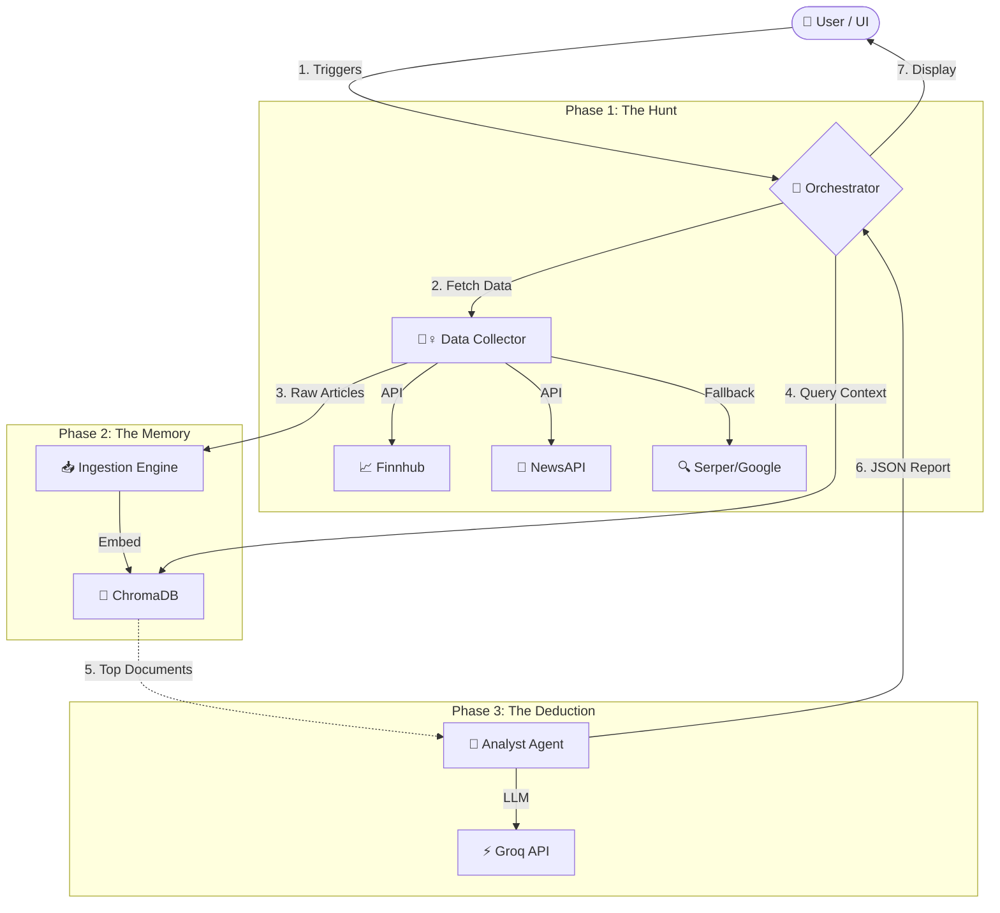
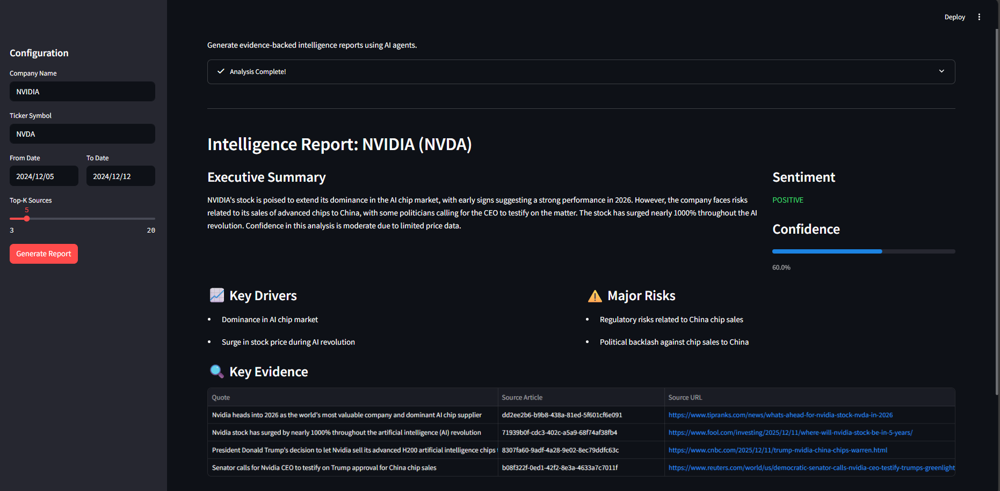
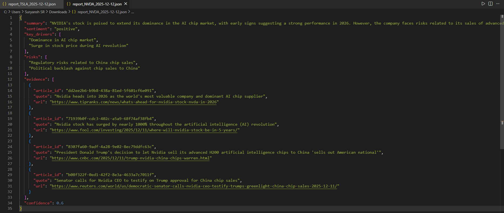
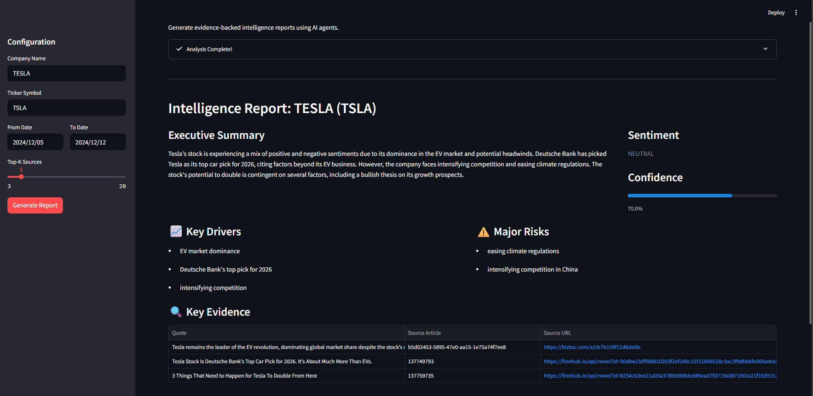
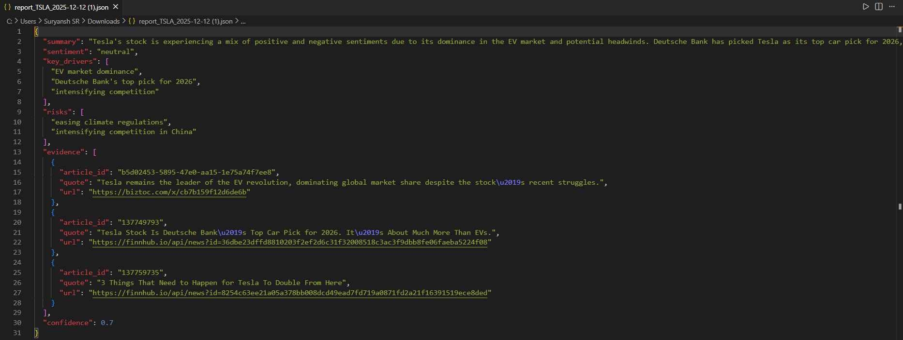

# 🤖 Task 1: Multi-Agent System using LangChain Agents 

A powerful **Multi-Agent System** that acts as your personal financial detective. It hunts down live stock data and news, reads through the noise using vector embeddings, and uses an LLM Analyst to write evidence-backed intelligence reports.

---

## 🚀 Features
- **🕵️‍♀️ Data Collector Agent**: Scours the web using **Finnhub** (Market Data), **NewsAPI** (Global News), and **Serper** (Google Search fallback).
- **📝 Analyst Agent**: A specialized LLM (**Groq/Llama-3**) that writes structured reports citing specific evidence.
- **🧠 Vector Memory**: Uses **ChromaDB** + **Sentence-Transformers** to "read" and remember thousands of articles.
- **🎼 Orchestrator**: Manages the synchronous pipeline from chaos to clarity.
- **✨ Streamlit UI**: A beautiful, interactive dashboard to control the investigation.

---

## 🛠️ Architecture Workflow



---

## 📸 Demo

### 1. Case Study 1: NVIDIA


### 2. Case Study 1: NVIDIA (exported results)


### 3. Case Study 2: TESLA


### 4. Case Study 2: TESLA (exported results)


---

## ⚡ Quick Start

### Prerequisites
- Python 3.10+
- API Keys for:
  - Finnhub
  - NewsAPI
  - Serper
  - Groq

### 1. Clone & Install
```bash
git clone https://github.com/yourusername/soulpage-task1.git
cd soulpage-task1
pip install -r requirements.txt
```

### 2. Configure Secrets
Rename `.env.example` to `.env` and add your keys:
```ini
FINNHUB_API_KEY=fh_...
NEWSAPI_KEY=...
SERPER_API_KEY=...
GROQ_API_KEY=gsk_...
```

### 3. Run the Detective 🕵️‍♂️
**Interactive UI:**
```bash
streamlit run streamlit_app/app.py
```
**Command Line:**
```bash
python src/main.py --company "Tesla" --ticker "TSLA"
```

---

## 🧪 Testing

Run the automated test suite to ensure the detectives are sharp:
```bash
python -m pytest tests/
```

## 🧩 Tech Stack
*   **LangChain** (Orchestration)
*   **Groq** (LLM Speed)
*   **ChromaDB** (Vector Store)
*   **Streamlit** (Frontend)
*   **Tenacity** (Resilience)

